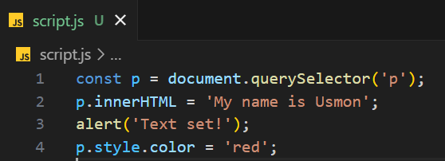

# Javascript lecture 2 Async

## Table of Contents

+ Synchronous
+ Asynchronous
+ new Promise
+ async/await
+ try/catch
+ fetch/request

## What is synch/async code in JavaScript ?

### Synchronous

Synchronous means the code runs in a particular sequence of instructions given
in the program. Each instruction waits for the previous instruction to complete
its execution.

+ `most code are synchtonous`
+ `Synchronous code is executed line by line`
+ ` Each line of code waits for previous line to finish.`

### Asynchronous code

Asynchronous programming provides opportunities for a program to continue
running other code while waiting for a long-running task to complete. The timeconsuming task is executed in the background while the rest of the code continues to
execute.

`Asynchronous code is executed after a task that runs`
`Its non-blocking`
`Callback function alone do NOT make codeasynchronous`
`Execution does not wait for an asynchronous task
to finish its work `

## Create Asynchronous code

### 1. Callbacks: 

### 2. Promise:

### 3. async/await:

## Asynchronous callbacks

Asynchronous callbacks are functions passed to another function that starts executing
code in the background. Typically, when the code in the background finishes, the async
callback function is called as a way of notifying and passing on data to the callback
function that the background task is finished.

## New Promise

In JavaScript, a promiseis a good way to handle asynchronous operations. It
is used to find out if the asynchronous operation is successfully completed or
not

## Promise example

## Keyword async

The async keyword transforms a regular JavaScript function into an
asynchronous function, causing it to return a Promise. The await keyword is
used inside an async function to pause its execution and wait for a Promise to
resolve before continuing
 
+ 1 ) The syntax of async function is:

+ 2 ) Example of async function :

## Try/catch

The try...catch construct attempts to execute the statements in the try
block, and if an error occurs, executes the catch block.

            This was a javascript 2 lecture 2